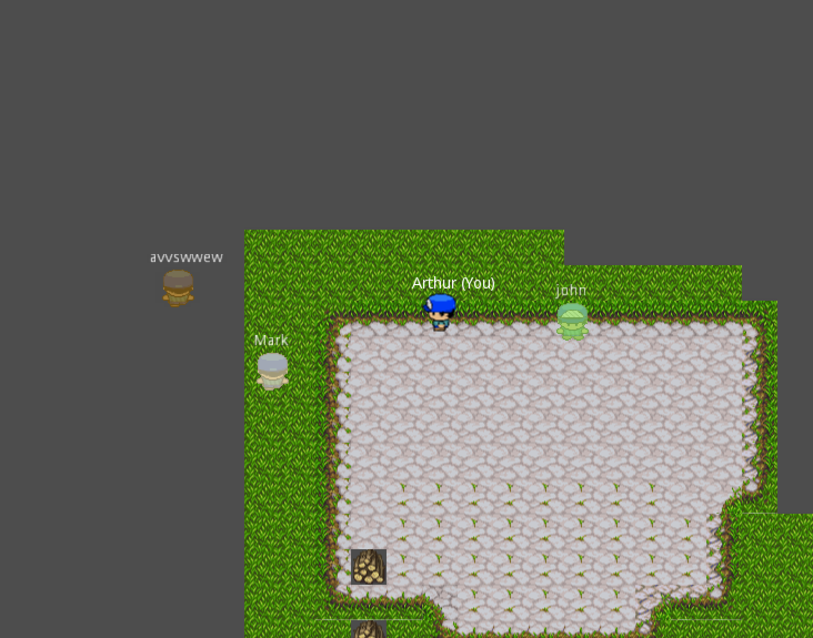

# Multiplayer Websocket Godot demo

This project implements a multi-room multiplayer game in Godot 3.2 using a Phoenix 1.5 backend.

Client-server communication uses the Phoenix channel protocol.

## How to run

You need Godot 3.2 and Elixir

Use Godot 3.2 to open the project, it can be executed as a native app or HTML 5. It is tested and works on mobile, too.

Then, enter in the `demo_backend` folder, install the dependencies with `mix deps.get` and start the server with `mix phx.server`.

The server listens at port 4000 bz default, you can test the channels going at `/testws`.

Running the demo in Godot you will be prompted for an username (IME is supported in native mode, the included font supports a wide range of non-English characters) and a room id.

You will be able to move in the map and see the other players that joined the same room id in real time.

Using a shader every player has a different color (based on the SHA1 of the name), but you see your player with the same blue color.

### Example:

### Future developments

I'm satisfied with the demo and don't plan to work more on it, but in case you want to develop on this or use it for some serious project, here are some things to be aware of:

* no tests!
* there's no authentication, the server trusts every username and you can even enter with the username of another user
* players are spawn at random positions, which may overlap. The initial position should be decided by the server to avoid this
* there's no mechanism to delete users who disconnect
* the state is stored using an Elixir/Erlang `Agent`, so it's not persisted across server sessions
* the mechanism broadcasts current positions as they change, so the performance can be bad with a lot of users. The client uses a simple linear navigation toward the target. It would be useful to have some momentum/prediction to send less data and reconciliate the positions in a nicer way. Alternatively, a navigation mechanism so the player clicks on the end position and the character moves toward it without "micromanaging" the movement
* there's no chat or any user interaction except occlusion
* there's no check to prevent client cheating
* the tilemap is quite dull, there are no layers nor animations
* there's only one character model, the color is changed using a shader

## License

This demo is MIT licensed, do whatever you want with it. Godot and Phoenix also are FOSS, of course.

The assets have a permissive license and are from these pages:

* tileset: https://opengameart.org/node/14914
* walking character: https://opengameart.org/content/rpg-character

The Godot Phoenix channel integration is from https://github.com/alfredbaudisch/GodotPhoenixChannels and is MIT licensed
